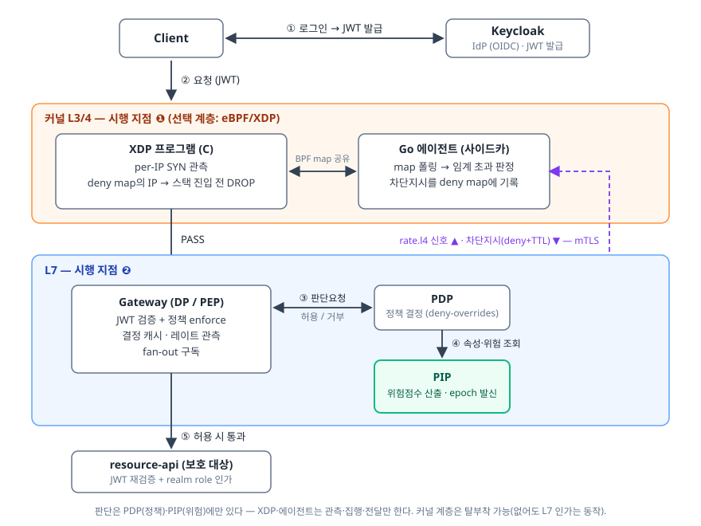

# Zero Trust Access Gateway

Keycloak과 직접 구현한 정책엔진(PDP/PIP)으로 제로트러스트 접근제어를 구성한 프로젝트다.
NIST SP 800-207의 표준 컴포넌트(PEP·PDP·PIP)를 Java/Spring 멀티모듈로 분리 구현했다.

로그인 시점의 1회 인증에서 끝나지 않는 것이 차별점이다.

- **지속검증 / 위험적응 인가** (continuous & risk-adaptive authorization) — 세션 중에도
  위험 신호를 반영해 접근을 회수한다. 같은 세션에서 새 IP나 요청 폭주가 관측되면
  재로그인 없이 다음 요청부터 결정이 ALLOW에서 DENY로 바뀐다.
- **커널 레벨 트래픽 제어** — 판단은 L7 거부에서 멈추지 않고, 커널(eBPF/XDP)에서 위험
  IP의 패킷을 직접 드랍하는 제어까지 이어진다([§5.3](#53-커널-레벨-트래픽-제어--위험-판단을-xdp-드랍으로-ebpfxdp)).

---

## 1. 문제 정의

제로트러스트는 "한 번 인증하면 끝"이 아니라, 누가 무엇을 어떤 조건에서 접근하는지 계속
판단하고 그 판단이 실제 트래픽 제어로 이어져야 한다는 모델이다. 이 프로젝트는 그 표준
구조를 컴포넌트 단위로 나눠 구현한다.

| 표준 용어 (NIST SP 800-207) | 역할 | 이 프로젝트의 모듈 |
|---|---|---|
| PEP (Policy Enforcement Point) / Data Plane | 트래픽을 가로채 허용·차단을 집행 | `gateway` (L7, Spring Cloud Gateway) · `xdp/` (L3/4 커널, 선택 계층) |
| PDP (Policy Decision Point) | 허용/거부를 판단 | `pdp` |
| PIP (Policy Information Point) | 판단에 필요한 맥락·위험점수 제공 | `pip` |
| IdP | "누가"를 증명 (로그인 → JWT) | Keycloak (Docker) |
| Resource | 실제 보호 대상 백엔드 | `resource-api` |

---

## 2. 아키텍처



요청 흐름을 따라가면 이렇다. Client가 Keycloak에서 JWT를 발급받아 요청에 싣는다.
요청 패킷은 게이트웨이에 닿기 전에 커널 시행 계층(XDP)을 먼저 지난다 — PIP가 차단을
지시한 IP면 스택 진입 전에 드랍되고([§5.3](#53-커널-레벨-트래픽-제어--위험-판단을-xdp-드랍으로-ebpfxdp)),
아니면 그대로 L7로 올라온다. 이 계층은 탈부착 가능한 선택 계층이며 스스로 판단하지
않는다(관측과 집행만 한다).

L7에서는 Gateway가 매 요청마다 JWT를 검증한 뒤 PDP에 "이 사용자가 이 리소스에 접근
가능한가"를 질의하고, PDP는 PIP에서 주체 속성과 동적 위험점수를 받아 정책을 평가한다.
허용이면 `resource-api`로 통과시키고 거부면 403을 반환한다. `resource-api`는 통과된
요청도 JWT를 한 번 더 독립 검증하고 realm role로 인가하며, 내부 신뢰헤더와 mTLS로
게이트웨이를 우회한 직접호출까지 차단한다.

> 검증 관계(다이어그램에는 생략): Gateway와 resource-api는 각각 Keycloak의 JWKS로 JWT를
> 독립 검증한다(서명/iss/exp) — 게이트웨이를 우회한 직접호출도 막는 이중 검증.
> 위험신호(IP·레이트·시각)는 Gateway가 관측해 전달하고, PIP가 받아 위험점수로 산출한다.

### 저장소 구성

```
zero-trust-gateway/
├── gateway/        # DP/PEP — JWT 검증, PDP 질의, 결정 캐시, 레이트 관측, fan-out 구독
├── pdp/            # 정책 결정 — ABAC(deny-overrides) + 위험 임계 판정
├── pip/            # 정책 정보 — 주체 속성 저장 + 동적 위험점수 산출, 위험 세대(epoch) 발신
├── resource-api/   # 보호 대상 백엔드 (게이트웨이 경유만 허용)
├── common/         # 모듈 간 DTO (Decision·Risk·Fanout 등)
├── xdp/            # 커널 시행 계층(선택) — XDP C 프로그램 + Go 에이전트 (Gradle 빌드 밖, WSL에서 실행)
└── docker/         # docker-compose, Keycloak realm, prometheus/grafana, 스모크·부하 스크립트
```

위 5개 Java 모듈은 Gradle 멀티모듈로 묶이고, `xdp/`는 빌드 수명·툴체인(clang/Go)·실행
주체(WSL 커널)가 달라 의도적으로 Gradle 밖에 둔다. `./gradlew build`에 영향이 없다.

---

## 3. 기술 스택

- **언어/빌드:** Java 21 · Gradle 멀티모듈 (컨트롤 플레인/L7) — 판단은 전부 여기서
- **커널 시행 계층(선택):** C (eBPF/XDP, clang+libbpf) · Go 에이전트 (cilium/ebpf) — `xdp/`
- **프레임워크:** Spring Boot 3.3
- **Gateway(DP):** Spring Cloud Gateway (리액티브 GlobalFilter로 enforce)
- **인증:** Spring Security Resource Server (JWT 검증, JWKS)
- **IdP:** Keycloak 26 (Docker, realm `ztg`)
- **정책엔진(PDP):** Java ABAC 엔진 (deny-overrides, 조건/임계 전부 설정화)
- **PIP 저장소:** in-memory 속성 + 휘발성 위험 신호
- **관측성:** Micrometer + Prometheus + Grafana, 요청 추적 ID(MDC) 상관
- **부하테스트:** k6
- **fan-out:** Redis pub/sub (다중 게이트웨이 캐시 무효화)
- **인프라:** Docker Compose

---

## 4. 지속검증 / 위험적응 인가

인증 데모는 대부분 로그인 시점의 허용에서 끝난다. 이 프로젝트는 세션이 살아있는 동안에도
위험이 바뀌면 접근을 회수하는 것을 목표로 잡았고, 아래 네 가지가 그 구현이다.

### 4.1 설명 가능한 동적 위험점수 (PIP)

`RiskEngine`은 아래 신호들을 가중합해 0~100 점수로 환산하고, 각 신호의 기여분을 점수와
함께 반환한다. 거부 응답에 "왜 막혔는지"를 실을 수 있게 하기 위해서다.

| 신호 | 의미 | 기본 가중치 |
|---|---|---|
| `baseline` | 주체 기본 신뢰도 (등록 사용자 낮음 / 미등록 높음) | 주체별 |
| `device-untrusted` | 관리되지 않는 단말 | 40 |
| `ip-change` | 직전 관측과 다른 출발지 IP (이동·탈취 신호) | 30 |
| `rate-burst` | 슬라이딩 윈도우 내 요청 폭주 | 40 |
| `rate-l4` | 커널(XDP)이 관측한 L4 SYN 폭주 | 40 |
| `off-hours` | 업무시간 외 접근 | 15 |

가중치와 임계값은 모두 설정으로 빼 두어, 코드 수정 없이 조건만 바꿔 ALLOW/DENY 결과를
뒤집어 볼 수 있다. 판정 조건의 상세는 각 절에 있다 — `rate-burst`의 폭주 밴드 판정은
히스테리시스를 쓰고([§4.3](#43-능동-캐시-무효화)), 다중 게이트웨이에서는 카운트를 Redis
전역 집계로 승격하며([§4.4](#44-다중-게이트웨이--fan-out과-전역-레이트-집계-redis)),
`rate-l4`는 토큰 없는 플러드도 잡는다([§5.3](#53-커널-레벨-트래픽-제어--위험-판단을-xdp-드랍으로-ebpfxdp)).

`ip-change`는 변화를 관측한 순간만이 아니라 **hold 창(`ip-change-hold`, 기본 30초) 동안
유지**된다. 순간 신호로 두면 안 되는 이유가 있다. 비교 기준(직전 IP)은 관측마다 새 IP로
덮이므로, 가중이 "바뀐 그 평가" 한 번에만 실리고 바로 다음 재평가(고위험 캐시 TTL
~1초)에서 사라진다. 그러면 탈취 시나리오의 DENY가 1초짜리 스파이크가 되어, 공격자가
재시도만 하면 통과한다. hold는 신호를 시간 창으로 늘려 이 재시도를 막는다. fan-out
메시지를 놓친 노드가 뒤늦게 재평가할 때 같은 상태를 보게 하는 효과도 있다 —
[§4.4](#44-다중-게이트웨이--fan-out과-전역-레이트-집계-redis)의 at-most-once 전파가
안전하려면 신호가 그만큼 살아 있어야 한다. 창 안에서 IP가 또 바뀌면 만료가 연장되고
(회전 = 지속 신호), 창이 지나면 자동 해제된다 — `rate-l4` hold와 같은 가역성 원리다.

> **신뢰 경계:** `X-Forwarded-For`는 발신자가 임의로 쓸 수 있는 자기 신고 값이라, 소켓
> 원격주소가 신뢰 프록시 목록(`ztg.gateway.trusted-proxies`, IP/CIDR)에 드는 발신일 때만
> 첫 홉을 출발지로 인정하고 아니면 소켓 주소를 쓴다. 무조건 믿으면 위조 XFF 고정으로
> `ip-change` 탐지를 영영 회피하거나, XFF 회전으로 캐시·PIP 상태를 오염시킬 수 있기
> 때문이다. 기본값은 loopback 신뢰 — 데모/스모크가 localhost 경유 XFF 주입으로 IP 변화를
> 시연한다. 운영이라면 빈 목록(fail-safe)에서 시작해 실제 LB 대역만 명시하는 것이 맞다.
>
> **좌표계 분리:** 출발지 IP는 **두 축으로 나뉘어 전달·기억된다**. `source-ip`(논리 축 —
> 위 신뢰 경계를 통과한 원 클라이언트 IP)는 `ip-change` 판정과 캐시 키에 쓰고,
> `network-ip`(네트워크 축 — "에지 피어", 커널이 관측 지점에서 패킷 소스로 보는 것과 같은
> 좌표. 기본은 게이트웨이 소켓 피어)는
> 커널 L4 신호의 주체 번역과 `rate-l4` 플래그 매칭에 쓴다([§5.3](#53-커널-레벨-트래픽-제어--위험-판단을-xdp-드랍으로-ebpfxdp)).
> LB/프록시 뒤에선 두 좌표가 달라지므로(논리=클라이언트, 네트워크=LB), 한 필드로 겸하면
> 커널 신호가 어떤 주체와도 연결되지 못한다 — 신호는 그 신호를 관측한 좌표계로 매칭해야 한다.
> 직결이면 두 축이 같아, 네트워크 축이 없는 신호는 논리 축으로 폴백한다.
>
> **에지 관측 배치(PROXY protocol):** 관측(XDP)을 LB 앞(진짜 에지)으로 옮기는 배치에선 커널이
> 클라이언트 IP 단위로 패킷을 보므로 게이트웨이도 같은 좌표가 필요하다 — L4 LB가 PROXY
> protocol로 광고한 원 클라이언트를 네트워크 축으로 채택한다(`ztg.gateway.proxy-protocol`,
> 기본 off). PP 헤더도 XFF와 동형의 자기 신고 값이라 **소켓 피어가 신뢰 발신 목록**
> **(`trusted-senders`, LB 대역)에 들 때만** 인정하며, 이렇게 정해진 에지 피어가 위 XFF 신뢰
> 판정의 기준이기도 하다 — L4 LB는 L7에 투명해 XFF를 쓸 수 있는 직전 홉이 곧 에지 피어이고,
> 덕분에 신뢰 LB 뒤 클라이언트가 위조한 XFF는 그대로 무시된다(위 신뢰 경계가 LB 뒤로 연장).

### 4.2 정책 결정 (PDP)

`PolicyEngine`은 deny-overrides 모델로 평가한다. 위험점수가 임계값(`risk-threshold`,
기본 80) 이상이면 리소스와 무관하게 거부하고, `payroll` 리소스는 finance 부서·업무시간·
신뢰 디바이스 조건을 모두 만족할 때만 허용하며, 그 외에는 기본 허용이다. 거부 사유에는
점수 기여 내역을 그대로 실어, 응답과 로그에서 차단 원인을 확인할 수 있다.

업무시간 판정의 시각은 PDP 자체 시계가 아니라 **게이트웨이가 요청마다 관측해 실은
hour**를 쓴다(PIP의 `off-hours` 가중과 같은 입력). 시각을 읽는 곳이 서비스마다 있으면
시간대가 섞인 배포에서 같은 순간의 판정이 판정 주체에 따라 갈리므로, 관측 지점을 한
곳으로 모았다. 요청 밖이라 자체 시계가 불가피한 경로(커널 L4 신호의 재평가)는 시간대를
설정(`ztg.*.zone`, 기본 `Asia/Seoul`)으로 고정해 같은 좌표를 쓰게 했다.

### 4.3 능동 캐시 무효화

게이트웨이는 PDP 왕복을 줄이기 위해 결정을 짧게 캐싱한다. 그런데 단순 TTL만 쓰면 캐시된
ALLOW가 TTL 동안의 위험 상승을 무시하게 되어 지속검증과 정면으로 충돌한다. 그래서 캐시
무효화를 부가 기능이 아니라 핵심 메커니즘으로 설계했다.

- **위험적응 TTL** — 고위험 결정일수록 짧게 캐싱해 더 자주 재평가한다 (`ttl = f(riskScore)`).

- **레이트 밴드 트리거** — 요청 레이트가 폭주 밴드로 전이하는 순간 캐시를 강제로 우회해
  즉시 재평가를 유발한다. 밴드가 바뀐 순간에만 발동하는 엣지 트리거다 — 레벨 트리거였다면
  폭주 내내 캐시가 무력화돼 성능 이점이 사라진다.
  밴드 판정은 **히스테리시스(이중 임계)** 를 쓴다. 진입은 60 초과, 해제는 40 이하, 사이
  구간은 직전 밴드를 유지한다. 단일 임계면 레이트가 경계에서 진동할 때마다 전이로 판정돼
  캐시 우회가 반복되고, PIP 쪽에서는 같은 진동이 점수 출렁임 → epoch 상승 → 전 노드 캐시
  무효화로 증폭된다. 그래서 게이트웨이 트리거와 PIP의 `rate-burst` 점수 판정 양쪽에 같은
  이중 임계를 적용했다.

- **epoch 키-아웃** — PIP는 주체의 위험 상태에 세대 번호(epoch)를 붙이고, 위험점수 **또는
  기여 팩터 구성**이 변한 순간 올린다. 점수만 보면 가중치가 같은 신호끼리 교체될 때(예:
  L7 폭주 가중 → 커널 L4 가중) 위험의 성격이 바뀌어도 무효화가 침묵하므로, 팩터 이름
  집합의 변화를 함께 본다 — 증거가 바뀌면 캐시된 결정도 다시 묻는다.
  게이트웨이는 PDP 결정이 운반해 온 epoch를 캐시 키에 넣는다. epoch가 오르면 이전 세대
  엔트리는 키 자체가 달라져 더는 조회되지 않고(키-아웃 = 즉시 무효화), 위험 전이 직후
  뒤늦게 도착한 옛 세대의 stale ALLOW도 새 세대의 DENY를 덮어쓰지 못한다(옛 결정은 옛
  세대 키에 고립된다).

- **고아 회수(sweep)** — 키-아웃된 옛 세대 엔트리와 회전된 IP로 적재된 엔트리는 다시
  조회될 키가 아니라서(고아), 조회 시점의 lazy 만료 제거가 영영 걸리지 않는다. 이를
  방치하면 공격자가 `X-Forwarded-For`만 회전시켜 캐시를 고아로 가득 채울 수 있고, 크기
  상한에 막힌 새 적재가 전부 버려져 캐시가 사실상 영구 off가 된다(모든 요청이 PDP 왕복 =
  공격자 유발 성능 DoS). 그래서 가득 참을 만난 적재가 만료 엔트리를 전수 회수한다 — 모든
  엔트리는 유한 TTL이므로 캐시 정지는 최대 TTL로 바운드된다. sweep 자체는 O(n) 스캔이라
  최소 간격(`sweep-interval`, 기본 1s)으로 스로틀해, 미만료 엔트리로 계속 채우며 헛스캔을
  유발하는 2차 CPU 소모도 막는다.

앞의 세 장치 덕분에, 같은 토큰·같은 세션에서 새 IP나 폭주를 주입하면 재로그인 없이 다음
호출이 ALLOW에서 DENY로 전이한다. 실제로는 이렇게 보인다 (`smoke-risk-adaptive.sh`의 한 장면,
토큰은 처음 한 번만 발급):

```text
$ curl -H "Authorization: Bearer $TOKEN" -H "X-Forwarded-For: 203.0.113.10" :8080/api/hello
HTTP/1.1 200        # baseline 10 + device-untrusted 40 = 50 < 임계 80 → ALLOW

$ curl -H "Authorization: Bearer $TOKEN" -H "X-Forwarded-For: 198.51.100.66" :8080/api/hello
HTTP/1.1 403        # 같은 토큰, 낯선 IP → ip-change +30 = 80 ≥ 80 → DENY
X-Denied-Reason: risk score 80 >= threshold 80 [baseline(+10): stored baseline risk
  for subject alice; device-untrusted(+40): access from an untrusted (unmanaged)
  device; ip-change(+30): source ip changed 203.0.113.10 -> 198.51.100.66]
```

폭주 시나리오도 같은 구조다(rate-burst +40 → 90점 DENY). 위험이 가시면 — 레이트 윈도우가
비면 — 다음 재평가에서 다시 200으로 복귀한다. 영구 차단이 아니라 위험에 적응하는
가역적 결정이다.

### 4.4 다중 게이트웨이 — fan-out과 전역 레이트 집계 (Redis)

게이트웨이가 여러 대인 구성에서는 단일 노드 설계의 전제 두 개가 깨진다. Redis가 두 역할로
그 간극을 메운다 (같은 플래그 `ztg.fanout.enabled` 하나로 함께 켜진다 — "게이트웨이가 여러
대"라는 같은 사실이 둘 다 요구하기 때문이다).

**무효화 전파 (pub/sub fan-out).** 위험을 유발하지 않은 노드는 TTL 동안 옛 ALLOW를 캐시
히트로 낼 수 있다. 그래서 위험 정보의 권위자인 PIP가 epoch 상승 시 Redis 채널로 발행하고,
모든 게이트웨이가 이를 구독해 즉시 키-아웃한다.

- 기본값은 OFF다 (`ztg.fanout.enabled=false`). 단일 노드나 테스트 환경은 Redis 없이 동작한다.
- 전달 보장은 at-most-once로 충분하다고 판단했다. TTL과 lazy 학습이 백스톱이라 한 번 놓쳐도 곧 수렴하며, 가용성을 우선해 publish 실패는 무시한다.
- Kafka 대신 Redis pub/sub을 쓴 이유: 지속성·재생 요구가 없어 이 규모에는 과하다.
- 수신 epoch는 검증 없는 **미신뢰 입력**이라 두 겹으로 견고화했다. 학습값 대비 과대
  점프(1000 초과)는 위조/오염으로 보고 무시한다 — 채택하면 그 주체의 조회 세대가 닿지
  않는 값으로 점프해 영구 캐시 미스가 된다. 학습값 자체도 신뢰 경로(PDP 왕복)의 확인이
  일정 시간(기본 60초) 끊기면 잊는다 — PIP 재기동으로 epoch가 0부터 다시 시작해도 캐시가
  자연 재동기화된다(자기치유). 망각 기한은 캐시 TTL 최대값 이상이도록 기동 시 강제해,
  잊는 순간 살아 있는 옛 세대 엔트리가 부활하는 일이 없다.

**전역 레이트 집계 (공유 슬라이딩 윈도우).** 레이트 카운터가 노드-로컬이면 두 가지가
깨진다. 첫째, 같은 주체의 폭주가 노드마다 1/N로 희석돼 어느 노드도 임계를 못 넘는다
(전역 폭주 미검출). 둘째, 노드마다 다른 카운트가 PIP의 주체당 밴드 상태에 섞여 비대칭
라우팅 시 밴드가 진동한다 — 밴드 진동은 epoch 상승으로, epoch 상승은 fan-out 무효화로
이어져 전 노드의 캐시가 계속 비워진다(성능 장치가 성능을 깎는 증폭).
그래서 다중 게이트웨이 모드에서는 레이트 관측 소유권을 Redis 공유 슬라이딩 윈도우로
승격한다. 주체별 zset에 "윈도우 밖 제거→기록→TTL 갱신→카운트"를 Lua 스크립트로 묶어
요청당 1왕복으로 원자 실행하고, 윈도우 시계는 노드 벽시계가 아니라 Redis `TIME`을
쓴다(노드 간 시계 편차 배제). 모든 노드가 같은 전역 카운트를 보므로 희석과 밴드 진동이
근원에서 사라진다.

- Redis 장애 시엔 노드-로컬 카운터로 강등한다(fail-degraded). 레이트는 보조 위험신호라,
  이것 때문에 전면 차단을 하면 잃는 가용성이 더 크다. 로컬 카운터는 평상시에도 함께
  세어(warm standby) 강등 순간 빈 윈도우로 시작하지 않고, 한 요청은 어느 경로로든 정확히
  한 번만 계상된다.
- sticky 라우팅/consistent hashing은 완화책은 되지만 정확성 메커니즘으로는 부족해 기각했다.
  라우팅 입력(IP·쿠키·토큰)을 폭주하는 쪽이 통제하고, failover 순간 콜드 카운터가 밴드
  진동을 재발시키기 때문이다. sticky의 자리는 캐시 지역성 최적화(보완재)다.

---

## 5. 운영 품질 (관측성 · 부하검증 · mTLS)

- **관측성:** 각 서비스가 `/actuator/prometheus`를 노출하고 Prometheus가 스크랩해 Grafana
  대시보드로 본다. PDP 호출 지연은 히스토그램으로 발행해 p99를 계산하고, 요청 추적 ID(MDC)로
  게이트웨이→PDP→PIP 로그를 같은 ID로 상관시킨다.
- **장애 안전:** PDP/PIP 호출 실패 시 fail-close(차단)를 기본값으로 선택했다. 라이브
  fail-close 스모크로 검증했다.
- **서비스간 mTLS:** 게이트웨이↔PDP↔PIP 내부 통신을 상호 TLS로 보호한다 (`compose-apps.yml`).
- **부하검증 (k6):** 결정 캐시 적용 전후를 같은 조건(VUs 50)으로 비교했다.

  | 지표 | 캐시 전 | 캐시 후 | 변화 |
  | --- | --- | --- | --- |
  | 처리량 | 9,010 rps | 14,681 rps | **+63%** |
  | p99 지연 | 12.7ms | 10.5ms | **−17%** |
  | 실패율 | 0% | 0% | — |

  위험적응 TTL·레이트 밴드 강제 우회 같은 신선도 장치를 켠 상태에서도 정상 경로 캐시
  히트율은 99.7%였고, 그중 레이트 밴드 강제 우회는 180초 동안 3회에 그쳤다(나머지 0.3%
  미스는 통상적인 TTL 만료와 최초 채움). 보안을 위한 재평가가 정상 트래픽 성능을 거의
  깎지 않음을 수치로 확인했다.

- **무효화 전파 지연 (다중 게이트웨이):** [§4.4](#44-다중-게이트웨이--fan-out과-전역-레이트-집계-redis)의
  "위험을 유발하지 않은 노드도 즉시 키-아웃한다"는 주장을 시간으로 측정했다. 한 게이트웨이(GW1)에서
  위험을 올린 순간부터 **다른** 게이트웨이(GW2)가 같은 토큰을 차단하기까지를 30라운드 반복 측정
  (`measure-fanout-propagation.sh`).

  | 구간 | 유휴 | 부하 중(타 주체 50 VUs·약 4.6k rps) |
  | --- | --- | --- |
  | 위험 트리거 → 타 노드 차단 관측 (p50 / p95) | 25 / 32ms | 44 / 50ms |
  | 그중 노드 간 전파만 (GW1 DENY 확정 → GW2 차단, p50) | 12ms | 20ms |

  노드 간 무효화가 **수십 ms**에 끝나 어떤 캐시 TTL보다 훨씬 짧고, 무관한 주체의 부하가 걸려도
  파국이 아니라 완만한 열화(전파 p50 12→20ms)에 그친다 — 보안 불변식(재로그인 없는 교차노드
  회수)이 성능 부하 아래에서도 유지됨을 수치로 확인했다. 폴링 1회 왕복(수 ms)이 측정 하한이라
  전파 수치는 상한이며, WSL 가상 환경이라 절대치가 아닌 상대 특성으로 해석한다.

### 5.1 패킷레벨 관측 — mTLS를 와이어에서 확인

mTLS 적용 여부를 설정이나 로그가 아니라 tcpdump로 뜬 실제 패킷에서 확인했다.

- 컨테이너 간 mTLS 트래픽은 호스트 tcpdump에 잡히지 않아, pdp 컨테이너의 네트워크
  네임스페이스에 사이드카를 붙여 gw→pdp, pdp→pip 두 구간을 한 지점에서 캡처했다.
- 단방향 TLS에는 없는 CertificateRequest(handshake type 13) 메시지, 그리고 서버 `CN=pdp`·
  클라이언트 `CN=gateway` 인증서 교환을 캡처에서 확인했다.
- 처음에는 인증서가 보이지 않았는데, 기본 협상이 TLS 1.3이라 핸드셰이크 자체가 암호화되기
  때문이었다. 관측 구간만 1.2로 내려 확인했고, 두 캡처를 대비하면 1.3이 핸드셰이크
  메타데이터까지 가린다는 점도 함께 드러난다.
- 인증서 없는 우회 호출은 빈 Certificate 메시지 후 서버의 fatal Alert로 연결이 끊기는
  것까지 캡처했다.

정리 문서: [docs/packet-study/mtls-wire-study.md](docs/packet-study/mtls-wire-study.md)
(상세 재현 절차 수록)

### 5.2 L4 트러블슈팅 — 장애를 와이어에서 진단

정책 경로(pdp↔pip)에 `tc netem`으로 지연 100ms·손실 5%를 주입하고, 증상을 패킷과 지표로
추적했다.

- 재전송 카운트가 netem을 건 링크(8083)에서만 0→107로 늘고 주입하지 않은 8084는 0을
  유지해, 패킷만으로 문제 구간을 격리할 수 있었다. e2e p99는 39.5ms에서 1.56s로 약 40배
  악화됐다.
- pip egress에 건 100ms 지연이 캡처 지점(pdp) 기준으로는 한 방향에는 보이지 않고 반대
  방향의 RTT로만 드러났다. 같은 장애도 관측 지점(vantage)에 따라 다르게 보인다.
- 재전송은 TCP 계층의 동작이라 mTLS와 무관하게 그대로 관측된다. 암호화되는 것은
  payload뿐이고, L4 증상은 평문으로 다 보인다.

정리 문서: [docs/packet-study/l4-netem-study.md](docs/packet-study/l4-netem-study.md)
(재현 절차·필터·검증 맵 수록)

### 5.3 커널 레벨 트래픽 제어 — 위험 판단을 XDP 드랍으로 (eBPF/XDP)

위험 판단(PIP)의 결과를 L7 거부에서 멈추지 않고 커널(XDP)에서 패킷을 직접 버리는
제어까지 이어냈다. 관측 지점과 제어 지점을 둘 다 L7에서 L3/4로 내린 것이다.

- **관측 하강:** 커널 XDP가 per-source-IP로 SYN을 세고, 사이드카가 임계 초과를 PIP에
  신호로 밀어 넣는다. 토큰 없는 SYN 플러드는 인증을 통과하지 못해 게이트웨이의 L7
  레이트에는 안 잡히지만, 커널 L4 관측에는 잡힌다. 플러드가 전부 401인데도 같은 세션이
  ALLOW→DENY로 전이하는 것이 그 증거다. 신호는 IP 단위로 도착하지만 인가는 주체 단위라,
  PIP가 그 IP를 **네트워크 축**(에지 피어 — 커널과 같은 좌표계,
  [§4.1](#41-설명-가능한-동적-위험점수-pip)의 좌표계 분리)으로 기억해 둔 주체로 번역한 뒤
  기존 재평가 경로(점수 변화 → epoch bump → 능동 무효화)를 태운다 — XFF 기반 논리 IP와
  좌표를 분리해 둔 덕에 LB/프록시 뒤에서도 이 번역이 어긋나지 않는다.
- **제어 하강:** 판단은 PIP가 하고 집행만 커널이 한다. PIP가 위험 IP에 대한 차단 지시(deny+TTL)를
  내리면 사이드카가 커널 deny map에 기록하고, 그 IP의 패킷은 스택 진입 전에 드랍된다 —
  클라이언트는 403이 아니라 L4에서 끊긴다. TTL이 만료되면 커널이 스스로 통과시켜(fail-safe)
  오탐이 영구 차단으로 굳지 않는다. 단 신호 IP가 에지 차단 제외 대역(`ztg.pip.edge-block-exempt`,
  신뢰 프록시/LB)에 들면 차단 지시를 생략하고 세션 축 재평가만 수행한다 — 공유 IP를 드랍하면
  그 경유 사용자 전원이 끊기기 때문으로, 잃는 것은 에지 최적화뿐 인가 회수는 유지된다.
  에지 관측 배치([§4.1](#41-설명-가능한-동적-위험점수-pip))에선 신호 IP가 클라이언트 단위라
  이 게이트에 걸릴 일이 없다 — 게이트는 관측이 게이트웨이 호스트에 남는 배치의 방어로 남는다.
- **상대 성능:** 같은 SYN 플러드에서 유저스페이스가 401로 처리하면 게이트웨이 CPU가 avg
  108%(peak 206%)까지 뛰지만, XDP가 스택 진입 전에 드랍하면 idle(0.2%)에 머문다. 커널 드랍이
  게이트웨이 CPU 약 108%p를 덜어냈다(WSL 가상 환경이라 절대치가 아닌 상대 델타로만 해석).

이 축(IP 단위 에지 차단)은 [§4](#4-지속검증--위험적응-인가)의 세션 단위 무효화를 대체하는
것이 아니라, 판단을 더 낮은 계층으로 전파하는 별도 축이다.
정리 문서: [docs/packet-study/xdp-study.md](docs/packet-study/xdp-study.md)
(구조·측정·한계 수록)

---

## 6. 빠른 시작

> 환경: Docker(WSL) + Java 21. Windows는 `.\gradlew.bat`, 그 외 `./gradlew`.

```bash
# 1) IdP(Keycloak) 기동 — realm 'ztg' 자동 import
docker compose -f docker/docker-compose.yml up -d

# 2) 빌드 (전체 회귀)
./gradlew build

# 3) 핫패스 4개 서비스 기동 (각 모듈)
./gradlew :resource-api:bootRun   # :8082
./gradlew :pip:bootRun            # :8083
./gradlew :pdp:bootRun            # :8084
./gradlew :gateway:bootRun        # :8080  ← 외부 진입점

# 4) 토큰 발급 후 게이트웨이로 호출
#    (docker/get-token.sh 가 Keycloak에서 JWT를 받아온다)
TOKEN=$(./docker/get-token.sh)
curl -H "Authorization: Bearer $TOKEN" http://localhost:8080/api/hello
```

| 서비스 | 포트 |
|---|---|
| gateway (진입점) | 8080 |
| keycloak | 8081 |
| resource-api | 8082 |
| pip | 8083 |
| pdp | 8084 |
| prometheus / grafana | 9090 / 3000 |

### 데모 스크립트 (`docker/`)

| 스크립트 | 보이는 것 |
|---|---|
| `smoke-gateway-pep.ps1` | JWT 검증 + 게이트웨이 enforce |
| `smoke-policy-attributes.ps1` | PDP/PIP 정책 분리 (payroll 조건부 허용) |
| `smoke-failclose.ps1` | PDP 장애 시 fail-close 차단 |
| `smoke-risk-adaptive.sh` | 재로그인 없이 ALLOW→DENY (새 IP·폭주 주입) |
| `smoke-fanout.sh` | 다중 GW Redis fan-out 무효화 + 전역 레이트 집계 (폭주를 두 GW에 반씩 나눠도 검출) |
| `measure-fanout-propagation.sh` | fan-out 무효화 전파 지연 측정 (위험 감지→타 GW 차단 ms) |
| `smoke-mtls.ps1` | 서비스간 mTLS |
| `loadtest.js` (k6) | 캐시 before/after 처리량·p99 |

---

## 7. 검증

- **단위 테스트:** 위험점수 가중합, 정책 결정(ALLOW/DENY), 캐시 epoch 키-아웃, fan-out 코덱 라운드트립,
  공유 레이트 집계의 로컬 폴백(fail-degraded·단일 계상), L4 재평가 정합(폭주 밴드 보존·등점 팩터
  교체 시 epoch bump).
- **e2e:** 정상 호출 ALLOW → IP 변경/폭주 주입 → 다음 호출 DENY (재로그인 없이).
- 전체 회귀는 `./gradlew build` 하나로 수행한다 (검증 실패 = 빌드 실패).

```bash
./gradlew build           # 전체 회귀
./gradlew test            # 단위/슬라이스 테스트만
```

---

## 8. 설계 원칙

- **fail-close 기본값** — 보안 데모이므로 모호하면 차단을 택하고 이유를 기록한다.
- **조건의 설정화** — 위험 가중치·임계·업무시간을 전부 외부화해, 코드 수정 없이 결과를 뒤집어 보일 수 있다.
- **설명 가능한 인가** — 모든 DENY는 "왜"(기여 신호·점수)를 응답과 로그에 남긴다.
- **점수는 PIP, 임계는 PDP** — 정보 산출과 정책 적용의 책임을 분리한다.

---

## 9. 한계와 확장

의도적으로 단순화한 부분과, 거기서 자연스럽게 이어지는 확장 지점이다.

- **출발지 IP 신뢰 경계가 IP 대역 기반** — XFF는 신뢰 프록시 발신만 인정하지만
  ([§4.1](#41-설명-가능한-동적-위험점수-pip)의 신뢰 경계 참조), 신뢰 판정 자체가 IP 대역
  목록이라 프록시 장비가 뚫리면 같이 뚫린다. 근본 확장은 토큰-채널 바인딩(cert-bound
  token, RFC 8705) — 출발지가 아니라 채널 자체를 증명한다.
- **커널 관측 지점이 게이트웨이 호스트(기본 배치)** — LB/프록시 뒤에선 커널이 보는 소스가
  전 클라이언트 공통의 LB IP라 L4 신호의 판별력이 낮아진다. 오폭 방어는 갖췄다 — 세션 축
  재평가는 가중합이 흡수하고, IP 단위 드랍은 제외 대역 게이트([§5.3](#53-커널-레벨-트래픽-제어--위험-판단을-xdp-드랍으로-ebpfxdp))가
  막는다. 근본 해법은 관측을 진짜 에지(LB 앞)로 옮기는 것으로, **LB 토폴로지 라이브에서 두 축
  모두 검증했다** — 드랍 축(플러드 클라이언트만 커널 드랍, 같은 LB 경유 정상 사용자는 통과)과
  세션 축(PROXY protocol이 공급한 원 클라이언트 좌표로 커널 신호→주체 번역, 같은 LB 경유
  사용자 중 해당 주체만 재로그인 없이 403 회수 — [§4.1](#41-설명-가능한-동적-위험점수-pip)의
  에지 관측 배치). 남은 한계는 이 배치가 기본값이 아니라는 것 정도다.
- **PIP 저장소가 in-memory(단일 인스턴스)** — 재기동 시 속성·위험 신호가 소실되고 PIP 자체의
  다중화가 없다. 게이트웨이 캐시는 파생 상태(경합의 최악이 재평가 비용)라 다중화가 쉬웠지만,
  PIP는 epoch 등 **권위 상태**를 들고 있어 그대로 여러 대를 띄우면 노드 간 epoch가 갈라져
  무효화를 놓친다(split-brain) — 상태 외부화(Redis) 또는 주체 단위 파티셔닝으로 단일 소유를
  복원하는 것이 다음 단계다. (재기동으로 epoch가 후퇴하는 부작용 자체는 게이트웨이 학습값
  망각으로 자기치유된다 — [§4.4](#44-다중-게이트웨이--fan-out과-전역-레이트-집계-redis).)
- **디바이스 신뢰가 정적 속성** — `device-untrusted`는 저장된 값일 뿐 실제 단말 상태(posture)
  연동이 없다. MDM/EDR 신호를 PIP의 입력으로 잇는 것이 제로트러스트의 다음 조각이다.
- **fail-close 열화 시나리오** — netem 지연·손실 주입에서는 TCP가 복구해 fail-close가 트리거되지
  않았다. 타임아웃을 유발하는 더 가혹한 주입으로 "정책 경로 열화 → DENY 전이"까지 잡는 것이
  확장 후보다 ([l4-netem-study.md §5](docs/packet-study/l4-netem-study.md)).
