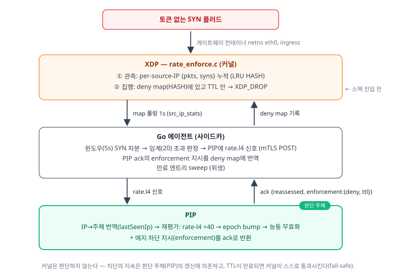

# 위험 판단을 커널 트래픽 제어로 잇기 — XDP 패킷 처리 기록

[실습1(mTLS 핸드셰이크 확인)](./mtls-wire-study.md)·[실습2(L4 netem 장애 진단)](./l4-netem-study.md)에
이은 실습3이다. 앞의 둘이 "패킷을 **본다**"였다면, 이번엔 위험 판단(PIP/PDP)의 결과를
**커널(XDP)에서 패킷을 직접 버리는** 제어로 잇는다. 관측 지점과 제어 지점을 둘 다 L7에서
L3/4로 내리는 것이 주제다 — eBPF/XDP, per-source-IP 레이트 관측, 커널 레벨 드랍(fail-safe TTL).

산출물은 커널 프로그램 [`xdp/rate_enforce.c`](../../xdp/rate_enforce.c), Go 사이드카
[`xdp/agent/`](../../xdp/agent/), 재현 스크립트 [`xdp/step2-e2e.sh`](../../xdp/step2-e2e.sh)·
[`xdp/step3-e2e.sh`](../../xdp/step3-e2e.sh)·[`xdp/step4-perf.sh`](../../xdp/step4-perf.sh)이다.

---

## 0. 요약

1. **관측 지점을 L7→L3/4로 내렸다.** 게이트웨이가 보는 L7 레이트(인증된 요청 수)는 토큰 없는
   SYN 플러드를 놓친다. 커널 XDP가 per-source-IP로 SYN을 세면 그 폭주가 잡힌다 — 플러드가 전부
   401인데도 DENY로 이어지는 것이 그 증거다.
2. **제어 지점도 L7→커널로 내렸다.** 같은 위험 판단을 L7 403(Step 2)이 아니라 XDP 드랍(Step 3)으로
   집행하면, 위험 IP의 패킷은 스택에 진입조차 못 한다 — 클라이언트는 403이 아니라 L4에서 끊긴다(000).
3. **판단은 PIP, 집행은 커널.** 커널은 스스로 판단하지 않는다. deny map에 적힌 결정만 TTL 동안
   집행하고, 결정은 PIP가 ack로 내린다. "인증/정책 판단 → 실제 트래픽 제어"의 화살표를 코드로 드러냈다.
4. **커널 드랍은 게이트웨이 CPU를 유저스페이스 처리 대비 ~100% 덜어낸다**(같은 플러드, §4). 절대
   성능(Mpps)은 가상 환경이라 범위 밖이고, 이 문서의 주장은 **같은 환경의 상대 델타**뿐이다.
5. **IP 축 에지 차단 ≠ 세션 축 인가.** XDP 드랍은 세션 무효화(주체 단위)의 대체가 아니라
   판단을 더 낮은 계층으로 전파한 **별도 축**이다. 데모에선 두 축이 같은 IP를 공유해 겹쳐 보인다(§5).

---

## 1. 구조 — 판단→제어 체인



**역할 분담(설계 핵심):**

| 계층 | 하는 일 | 안 하는 일 |
| --- | --- | --- |
| 커널(XDP) | 관측(카운트) + deny map 결정 **집행**(TTL 내 드랍) | 판단 안 함 |
| Go 에이전트 | 레이트 계산·임계 판정, PIP 지시의 **커널 번역**, 만료 sweep | 최종 인가 판단 안 함 |
| PIP | **판단 주체** — 주체 재평가 + 에지 차단 지시(enforcement) | 패킷 직접 조작 안 함 |

핵심은 **이 축이 새 enforcement 체계가 아니라 기존 지속검증 파이프의 새 입력**이라는 것이다. L4 신호는 요청
밖(out-of-band)에서 IP 단위로 도착하는데 인가는 주체 단위다 → PIP가 `lastNetworkIp`(게이트웨이 소켓
피어 = 커널이 패킷에서 보는 것과 같은 **네트워크 축** 좌표 — XFF 반영 논리 IP와 분리해 기억)로 IP를
주체로 번역한 뒤 기존 `assess`를 태우면, 점수변화→epoch→능동 무효화가 그대로 발화한다. XDP 드랍은
거기에 "에지 축"을 하나 더 얹은 것이다.

---

## 2. 왜 두 계층을 다 내렸나 — L7이 못 보는 것

게이트웨이 L7 레이트(`rate.l7`)는 **인증을 통과한 요청 수**를 센다. 그래서 토큰 없이 커넥션만
퍼붓는 SYN 플러드는 전부 401로 빠져 L7 카운터에 잡히지 않는다. 반면 커널 XDP는 TCP 플래그를
보므로 `syn && !ack`를 IP별로 세어 그 폭주를 관측한다. 신호 타입을 `rate.l7`/`rate.l4`로 분리한
이유가 이것이다 — 관측축이 다르고(요청 수 vs 연결 시도 수), 둘이 동시에 켜지면 서로 다른 증거로
각각 가산된다.

제어도 같은 논리다. L7 403은 이미 게이트웨이가 커넥션을 받아 TLS·필터·JWT 파싱까지 한 **뒤**에
내리는 거부다. 폭주가 지속되면 그 처리 비용 자체가 부담이 된다. XDP 드랍은 SYN을 스택 진입 전에
버리므로 그 비용을 아예 없앤다(§4에서 CPU로 측정).

---

## 3. 커널이 직접 만료를 판정한다 (fail-safe)

deny map 엔트리는 `{expires_at_ns, drops}`이고, 커널은 `bpf_ktime_get_ns() < expires_at_ns`일
때만 드랍한다. 만료 판정을 **커널이 직접** 하는 것이 안전 기본값의 핵심이다.

- 에이전트가 죽어 엔트리를 못 지워도, TTL이 지나면 커널이 그냥 통과시킨다 → **오탐이 영구 차단으로
  굳지 않는다**. 차단의 지속은 "살아 있는 판단 주체(PIP→에이전트)의 갱신"에만 의존한다(세션 무효화
  kill-switch 가역성과 같은 논리).
- enforcement TTL을 hold(주체 무효화 창)와 **같은 값(30s)** 으로 묶어, 세션 축과 에지 축의 가역성
  창을 일치시켰다.
- deny map은 LRU가 아닌 **일반 HASH**다. 차단 결정이 조용히 evict되면 집행에 구멍이 나므로, 꽉
  차면 새 등록만 실패하고 기존 차단은 유지한다(fail-close 방향). 관측 map(LRU, 유실 허용)과 안전
  방향을 의도적으로 반대로 갈랐다.
- 만료 시각은 커널과 **같은 시계**(CLOCK_MONOTONIC = `bpf_ktime_get_ns`)로 계산해 벽시계 점프에
  안전하게 했다. 재지시는 만료를 연장하되 드랍 카운트(집행 증거)는 보존한다.

---

## 4. 상대 성능 — 유저스페이스 처리 vs 커널 드랍

같은 SYN 플러드에서 그 패킷이 **(A) 스택으로 올라가 유저스페이스가 처리**(매 요청 TCP+HTTP+JWT
필터→401)할 때와 **(B) XDP가 스택 진입 전에 드랍**할 때 게이트웨이 컨테이너의 CPU%를 비교했다.

**공정성 통제:** 두 팔 모두 같은 `rate_enforce.o`를 attach한 상태로 측정한다. 유일한 차이는 deny
map이 비었나(A: 전부 `XDP_PASS`) / 플러드 소스 IP가 박혀있나(B: 그 IP만 `XDP_DROP`)뿐이다. 즉 XDP
프로그램의 상시 오버헤드는 양팔에 공통이고 순수하게 "드랍의 효과"만 남는다 — 캐싱 부하검증의 "게이트웨이만
토글" 통제와 같은 결이다. 커널드랍(B)을 **먼저** 깨끗한 상태에서 돌리고, B에서 실제로 커널이
드랍했음을 deny map `drops>0`으로 못박는다(측정 내 자기검증 — A가 먼저면 TIME_WAIT 축적으로 B의
클라이언트가 SYN조차 못 보내 "게이트웨이가 한가한 게 XDP 덕인지 클라 굶주림인지"가 흐려진다).

**측정치**(WSL2, 24 워커 × 20s 플러드, `docker stats` 8샘플 평균 — [step4-perf.sh](../../xdp/step4-perf.sh)):

| 구성 | 게이트웨이 CPU avg / max | 스택 도달 요청 | 커널 드랍 |
| --- | --- | --- | --- |
| idle(참고선) | 0.2% / 0.2% | — | — |
| **A. 유저스페이스 처리** (deny map 빔) | **108.2% / 205.8%** | 28,234건(전부 401) | 0 |
| **B. XDP 커널 드랍** (소스 IP 핀) | **0.2% / 0.2%** | **0건** | **598** |

→ **XDP 드랍이 게이트웨이 CPU를 ~108%p(≈100% 상대) 덜어냈다**(108.2% → idle과 구분 안 되는
0.2%). B에서 커널 드랍 카운터가 598로 오른 것이 "게이트웨이가 한가한 이유 = 유저스페이스가 이
패킷을 아예 못 봤기 때문"의 증거다. A는 같은 플러드를 28,234건의 401로 갈아넣느라 코어 1개를
통째로(+peak 2코어) 태웠다.

> ⚠️ **절대 성능은 범위 밖.** WSL2 veth는 가상 데이터패스라 Mpps 같은 절대치는 의미 없다. 이
> 측정의 주장은 "같은 환경·같은 부하에서 커널 드랍이 유저스페이스 처리 대비 게이트웨이 CPU를 얼마나
> 덜어내나"라는 **상대 델타**뿐이다(캐싱 부하검증의 +63%/−17%과 같은 상대 비교 서사).

---

## 5. IP 축 차단 ≠ 세션 축 인가 (정직한 한계)

데모에선 플러드와 정상 사용자(alice)가 **같은 호스트 IP**(172.18.0.1=도커 브리지 GW)에서 나간다.
그래서 그 IP를 커널에서 막으면 alice의 정상 트래픽도 함께 끊긴다(000). 이건 결함이 아니라 **"IP 단위
에지 차단"의 성질 그대로**다.

- **세션 축(세션 무효화):** 주체(alice) 단위로 위험을 평가해 그 주체의 결정을 ALLOW→DENY로 무효화한다.
  같은 IP의 다른 주체나, 같은 주체의 위험이 식으면 개별적으로 가역된다.
- **에지 축(커널 드랍):** IP 단위로 패킷을 버린다. 주체를 구분하지 않는다 — 그 IP에서 오는 모든 것이 끊긴다.

두 축은 **대체가 아니라 보완**이다. 실서비스라면 공격 IP와 정상 IP가 갈리므로 에지 차단이 정상
사용자를 끊지 않는다. 데모의 "alice도 함께 000"은 두 축이 우연히 같은 IP를 공유해 겹쳐 보이는
것일 뿐이고, 이 구분을 흐리지 않으려고 enforcement TTL을 hold와 묶어 두 축의 가역성 창을
일치시켰다(§3).

**그 밖의 의도된 한계:**

- **L4 한정.** TLS라 XDP가 보는 건 IP·포트·TCP 플래그·레이트뿐이다(L7은 암호문). 실습2의 L4
  서사와 일관되며, L7 경로별 정책은 여전히 게이트웨이(PEP)의 몫이다.
- **노드 로컬.** deny map은 이 게이트웨이 노드의 커널에만 있다. 다중 게이트웨이로 에지 차단을
  전파하려면 세션 축의 Redis fan-out처럼 별도 배포 채널이 필요하다(현재는 세션 축만 fan-out).
- **관측 IP 신뢰.** XDP가 보는 소스 IP는 스푸핑될 수 있다(단일 SYN 스푸핑). 데모 목적의 단순화이며,
  운영이라면 RPF·SYN 쿠키·업스트림 필터와 조합해야 한다.

---

## 6. 환경·툴체인

- **커널:** WSL2 Ubuntu-24.04, 6.6.87. **BTF 존재**(`/sys/kernel/btf/vmlinux`) → CO-RE 가능.
- **툴체인:** clang 18(BPF 타겟), libbpf 1.3, bpftool 7.4. bpftool은 WSL 커널용 패키지가 없어
  `linux-tools-generic`의 바이너리를 직접 경로로 호출(`/usr/lib/linux-tools/*/bpftool`).
- **attach:** 게이트웨이 **컨테이너 netns 안 eth0**에 native(driver) 모드로 붙인다. XDP는 RX
  전용이라 host-side veth에 붙이면 컨테이너발(egress)만 보인다 — 게이트웨이로 "들어오는" 트래픽을
  보려면 컨테이너 안쪽 eth0가 맞다. BPF map은 netns 무관하게 호스트 bpftool로 dump된다.
- **에이전트:** Go(cilium/ebpf) 단일 바이너리. map을 map ID 공간 순회로 찾고(핀 불필요), PIP
  데이터 포트가 mTLS라 클라이언트 인증서를 제시한다.

---

## 재현 / 필터

**전제:** docker mTLS 스택 기동(`up-mtls-docker.ps1`, pip 이미지에 enforcement ack 포함). root 필요.

```bash
# Step 2 — 관측→신호→ALLOW→DENY (제어 지점 L7 403)
sudo bash xdp/step2-e2e.sh    # → xdp/out/step2-e2e.out

# Step 3 — enforcement 캡스톤 (제어 지점 커널 드랍, alice 000)
sudo bash xdp/step3-e2e.sh    # → xdp/out/step3-e2e.out

# Step 4 — 상대 성능(유저스페이스 vs 커널 드랍 CPU)
sudo bash xdp/step4-perf.sh   # → xdp/out/step4-perf.out
```

**bpftool로 관측:**

```bash
BPFTOOL=$(ls -d /usr/lib/linux-tools/*/)bpftool
$BPFTOOL map dump name src_ip_stats     # per-IP {pkts, syns} 관측 카운터
$BPFTOOL map dump name deny_ips          # 차단 목록 {expires_at_ns, drops}
```